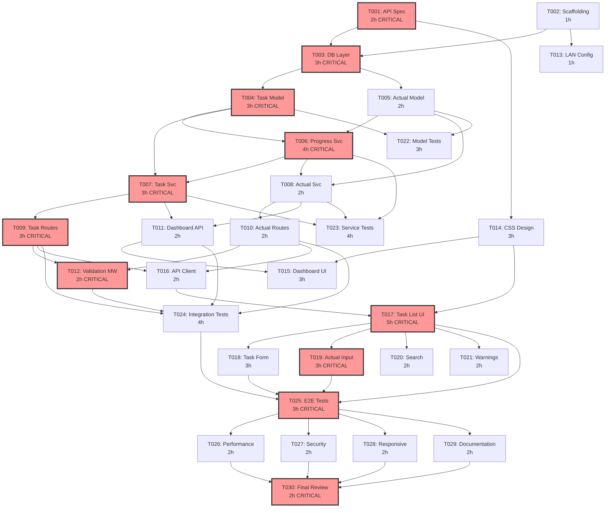

# CRITICAL_PATH.md - Budget Tracker Critical Path Analysis

## 1. Critical Path Identification

The critical path is the longest chain of dependent tasks that determines the minimum project duration. Any delay on this path directly delays the entire project.

### 1.1 Critical Path Chain

```
T001 (API Spec)         2h
  └─ T003 (DB Layer)    3h
       └─ T004 (Task Model)  3h
            └─ T006 (Progress Service)  4h
                 └─ T007 (Task Service)  3h
                      └─ T009 (Task API Routes)  3h
                           └─ T012 (Validation)  2h
                                └─ T017 (Task List UI)*  5h
                                     └─ T019 (Actual Input UI)  3h
                                          └─ T025 (E2E Test)  3h
                                               └─ T030 (Final Review)  2h

* T017 also depends on T014 (CSS) and T016 (API Client)
```

**Critical Path Duration: 33 hours (sequential)**

### 1.2 Critical Path Visualization

```
Time  0h     2h     5h     8h     12h    15h    18h    20h    25h    28h    31h    33h
      |------|------|------|------|------|------|------|------|------|------|------|------|
      T001   T003   T004   T006         T007   T009   T012   T017              T019   T025  T030
      API    DB     Task   Progress     Task   Task   Valid  Task List UI      Actual E2E   Final
      Spec   Layer  Model  Service      Svc    Routes MW                       Input        Review
      [CP]   [CP]   [CP]   [CP]         [CP]   [CP]   [CP]   [CP]             [CP]   [CP]  [CP]
```

### 1.3 With Parallel Execution

By running non-critical tasks in parallel with the critical path, we reduce wall-clock time significantly.

```
Step 1 (0-2h):    T001 ═══════╗  T002 ───────
                              ║
Step 2 (2-5h):    T003 ═══════╣  T013 ───────  T014 ───────
                              ║
Step 3 (5-8h):    T004 ═══════╣  T005 ───────
                              ║
Step 4 (8-12h):   T006 ═══════╣
                              ║
Step 5 (12-15h):  T007 ═══════╣  T008 ───────  T022 ───────
                              ║
Step 6 (15-18h):  T009 ═══════╣  T010 ───────  T011 ───────  T016 ───────
                              ║
Step 7 (18-23h):  T012 + T017 ═╣  T015 ───────  T023 ───────
                              ║
Step 8 (23-27h):  T018 + T019 ═╣  T020 ───────  T021 ───────  T024 ───────
                              ║
Step 9 (27-30h):  T025 ═══════╣
                              ║
Step 10 (30-32h): T026 ───────  T027 ───────  T028 ───────  T029 ───────
                              ║
Step 11 (32-34h): T030 ═══════╝

═══ = Critical Path     ─── = Parallel (non-critical)
```

**Optimized Duration: ~34 hours wall-clock (with 3 parallel agents)**
**Speedup vs Sequential: ~50%+ (sequential total: ~70 hours)**

---

## 2. Task Slack Analysis

Slack = Latest Start - Earliest Start. Tasks with 0 slack are on the critical path.

| Task ID | Task Name | Duration | Earliest Start | Latest Start | Slack | On CP? |
|---------|-----------|----------|---------------|-------------|-------|--------|
| T001 | API Spec | 2h | 0h | 0h | 0h | YES |
| T002 | Scaffolding | 1h | 0h | 1h | 1h | No |
| T003 | DB Layer | 3h | 2h | 2h | 0h | YES |
| T004 | Task Model | 3h | 5h | 5h | 0h | YES |
| T005 | Actual Model | 2h | 5h | 6h | 1h | No |
| T006 | Progress Service | 4h | 8h | 8h | 0h | YES |
| T007 | Task Service | 3h | 12h | 12h | 0h | YES |
| T008 | Actual Service | 2h | 12h | 13h | 1h | No |
| T009 | Task API Routes | 3h | 15h | 15h | 0h | YES |
| T010 | Actual API Routes | 2h | 15h | 16h | 1h | No |
| T011 | Dashboard API | 2h | 15h | 16h | 1h | No |
| T012 | Validation MW | 2h | 18h | 18h | 0h | YES |
| T013 | LAN Config | 1h | 1h | 4h | 3h | No |
| T014 | CSS Design | 3h | 2h | 15h | 13h | No |
| T015 | Dashboard UI | 3h | 18h | 22h | 4h | No |
| T016 | API Client | 2h | 18h | 18h | 0h | No* |
| T017 | Task List UI | 5h | 20h | 20h | 0h | YES |
| T018 | Task Form UI | 3h | 25h | 25h | 0h | Near-CP |
| T019 | Actual Input UI | 3h | 25h | 25h | 0h | YES |
| T020 | Search/Filter | 2h | 25h | 28h | 3h | No |
| T021 | Warnings UI | 2h | 25h | 28h | 3h | No |
| T022 | Model Tests | 3h | 8h | 20h | 12h | No |
| T023 | Service Tests | 4h | 15h | 21h | 6h | No |
| T024 | Integration Tests | 4h | 20h | 24h | 4h | No |
| T025 | E2E Tests | 3h | 28h | 28h | 0h | YES |
| T026 | Performance Opt | 2h | 31h | 32h | 1h | No |
| T027 | Security Review | 2h | 31h | 32h | 1h | No |
| T028 | Responsive Check | 2h | 31h | 32h | 1h | No |
| T029 | Documentation | 2h | 31h | 32h | 1h | No |
| T030 | Final Review | 2h | 33h | 33h | 0h | YES |

*T016 is technically not on the longest path but has near-zero slack due to T017 dependency.

---

## 3. Risk Assessment (Conservative)

### 3.1 High-Risk Items

| Risk | Impact | Probability | Mitigation |
|------|--------|-------------|------------|
| Progress calculation complexity | Incorrect parent aggregation, edge cases with 0 planned hours | Medium | Extensive unit tests for progressService; define fallback behavior clearly |
| SQLite concurrent write conflicts | Data corruption or lock errors when multiple LAN users attempt writes | Low | Use WAL mode; all writes are server-side via single Express process |
| Inline editing UX complexity | Click-to-edit may conflict with drill-down click; save/cancel confusion | Medium | Use double-click for edit, single-click for navigation; clear visual edit mode |
| 3-level hierarchy rendering | Deep nesting makes UI cluttered or confusing | Low | Drill-down navigation (not nested tree); breadcrumbs for context |
| Date handling edge cases | Timezone issues, DST transitions, date comparison bugs | Medium | Standardize on ISO 8601 dates (YYYY-MM-DD) without time; use date-fns if needed |

### 3.2 Medium-Risk Items

| Risk | Impact | Probability | Mitigation |
|------|--------|-------------|------------|
| better-sqlite3 installation | Native module compilation may fail on some systems | Low | Use prebuilt binaries; document Node.js version requirement |
| LAN access firewall issues | OS firewall may block port 3000 | Medium | Display clear instructions on startup; document firewall exceptions |
| CSS cross-browser rendering | Progress bars, flexbox layout differences | Low | Test on Chrome/Safari/Firefox; use well-supported CSS features only |

### 3.3 Low-Risk Items

| Risk | Impact | Probability | Mitigation |
|------|--------|-------------|------------|
| SQLite file corruption | Data loss | Very Low | WAL mode; recommend periodic file backup |
| Large dataset performance | Slow queries with 1000+ tasks | Low | Proper indexes; pagination; lazy loading |

---

## 4. Schedule Estimate

### 4.1 Optimistic (Best Case)
- Design: 0.5 days (3h effective)
- Backend: 1.5 days (12h effective)
- Frontend: 1.5 days (12h effective)
- Testing: 1 day (8h effective)
- Quality + Delivery: 0.5 days (4h effective)
- **Total: 5 days**

### 4.2 Realistic (Expected Case)
- Design: 1 day (includes revision)
- Backend: 2 days (includes debugging)
- Frontend: 2 days (includes CSS tweaking)
- Testing: 1.5 days (includes fix loops)
- Quality + Delivery: 1 day
- **Total: 7-8 days**

### 4.3 Pessimistic (Worst Case)
- Design: 1 day
- Backend: 3 days (complex progress logic issues)
- Frontend: 3 days (inline editing complexity)
- Testing: 2 days (coverage target difficulty)
- Quality + Delivery: 1.5 days
- **Total: 10-11 days**

### 4.4 Confidence Interval
Using PERT estimate: (O + 4M + P) / 6 = (5 + 4*7.5 + 10.5) / 6 = **7.6 days**

---

## 5. Dependency Graph



---

## 6. Resource Allocation Strategy

### 6.1 Agent Assignment

| Phase | Critical Path Agent | Parallel Agent 1 | Parallel Agent 2 |
|-------|-------------------|------------------|------------------|
| Design (Step 1) | T001: API Spec | T002: Scaffolding | - |
| DB (Step 2-3) | T003 -> T004: DB + Task Model | T005: Actual Model | T014: CSS |
| Services (Step 4-5) | T006 -> T007: Progress + Task Svc | T008: Actual Svc | T022: Model Tests |
| API (Step 6-7) | T009 -> T012: Routes + Validation | T010, T011: Other routes | T016, T023: Client + Tests |
| Frontend (Step 7-8) | T017 -> T019: Task List + Actual UI | T015, T018: Dashboard + Form | T020, T021, T024: UX + Tests |
| Testing (Step 9) | T025: E2E Tests | - | - |
| Quality (Step 10) | T026: Performance | T027: Security | T028 + T029: Responsive + Docs |
| Delivery (Step 11) | T030: Final Review | - | - |

### 6.2 Key Principle
- Always prioritize the critical path task first
- Fill parallel slots with highest-priority non-critical tasks
- Never start a task before all dependencies are complete
- If critical path task is blocked, use time for testing tasks (they have high slack)
